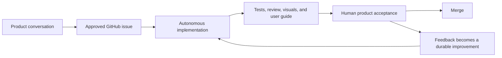

# Drift Agent Workflow

This file is the single source of truth for how agents help build Drift. Skills
apply this workflow; they do not redefine it.

## Mental model

Treat Codex like a capable engineer learning the product, not a script following
an exhaustive checklist.



GitHub says what to build. This workflow defines authority. Skills provide
reusable responsibilities. Tests, reviews, and product evidence create
confidence. Human feedback helps the system improve.

## Model delegation

Use the least expensive model that can reliably own the decision:

```text
Luna gathers evidence and handles routine output.
Terra coordinates and implements normal product work.
Sol is consulted for high-cost mistakes: architecture and design judgment.
```

The project-scoped agent definitions in `.codex/agents/` implement this routing:

- `drift-scout` uses Luna/Low for read-only exploration, evidence gathering,
  log analysis, and documentation audits.
- `drift-documenter` uses Luna/Medium for sequential user-guide maintenance.
- `drift-engineer` uses Terra/High as the single implementation writer.
- `drift-reviewer` uses GPT-5.3-Codex/High for independent code review.
- `drift-architect` uses Sol/High only for consequential architecture,
  concurrency, lifecycle, permissions, persistence, security, and platform
  decisions.
- `drift-ui-specialist` uses Sol/High for Figma handouts and final visual
  judgment, not routine UI coding.

The root task uses Terra/Medium to preserve context and coordinate results.
Keep delegation depth at one. Do not ask a worker to spawn more workers.

Do not enable Fast mode when conserving credits. Do not use Sol for routine
search, formatting, GitHub operations, test-log summaries, documentation, or
ordinary implementation.

## Responsibilities

The user owns product direction, priority, experience quality, consequential
product tradeoffs, and merge authorization.

Codex owns implementation details, proportionate planning, tests, independent
review, visual verification, user-guide maintenance, and preparing a reviewable
pull request.

Codex works autonomously after an issue is approved. It pauses only for a
material ambiguity or a decision involving architecture, dependencies,
persistence, permissions, security, concurrency, destructive data changes,
platform support, API availability, or meaningful scope expansion.

## Work lifecycle

1. Discuss and shape an idea.
2. Draft an issue or a parent issue with independently useful sub-issues.
3. Let the user approve the complete draft and Priority before publishing.
4. Mark work `ready-for-agent` only after explicit approval.
5. Start an issue only when the user asks. Do not automatically drain the
   backlog until the user adopts that behavior later.
6. If another collaborator has claimed the issue, leave it with them and wait.
7. When Codex actually begins work, assign the issue to the authenticated user,
   create one dedicated branch, and use `drift-engineer` as the single
   implementation writer.
8. Plan in proportion to risk. Ask for plan approval only for consequential
   changes.
9. Implement, test, independently review, visually verify relevant UI, and
   update the user guide for user-visible behavior.
10. Open a pull request with product-facing evidence. Never merge without the
    user's authorization.

Large changes require full product acceptance. A change is large when it
introduces a new user-facing capability, substantially redesigns a screen or
workflow, changes primary gesture behavior, migrates user data, changes
permissions or background behavior, introduces a new architectural owner or
dependency, or combines several sub-issues into one experience.

## UI work

Screenshots are evidence, not a complete specification. For UI work, use
`drift-figma-handout-pack` to record design intent, relationships, states,
interactions, resizing behavior, exact constraints, and intentionally flexible
details.

Implementation must be checked in the running interface where practical.
Compare the actual result with the approved handout instead of judging fidelity
from SwiftUI code alone.

Do not invent design values or motion. Follow the UI and animation constraints
in the nearest `AGENTS.md`.

## User guide

`docs/user-guide/` explains the shipped product from the user's perspective.
User-visible behavior is not complete until the affected guide is updated or
verified as already accurate.

The guide covers what functionality does, how to use it, relevant settings,
permissions, important states, failures, and recovery. Use screenshots of the
shipped interface when they materially improve understanding.

## Learning loop

After rejected or substantially revised work, identify the actual failure:
product understanding, design handout, implementation reasoning, missing test,
weak visual verification, inaccurate documentation, missing guidance, or a
review gap.

Propose the smallest generalizable prevention. This may be a test, clearer
issue, skill adjustment, `AGENTS.md` rule, review improvement, or user-guide
correction. Do not turn one-off preferences into permanent policy and do not
change durable workflow guidance without user approval.
