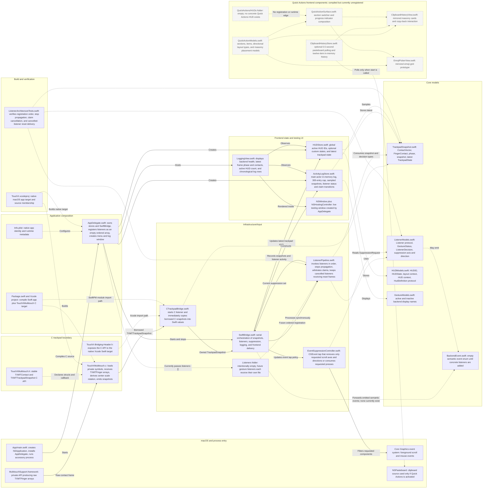

# TouchX codebase map

Solid arrows show active runtime flow. Dotted arrows show type/build dependencies or code that is available but currently unregistered.

## Important current-state notes

- `AppDelegate` registers `listeners: []`, so there are no built-in gestures.
- `BackendEvent` has no cases because no listener currently emits a semantic event.
- The Quick Actions models and views still compile, but nothing creates or presents them.
- C owns snapshot reduction; Swift immediately copies borrowed C memory before processing it.
