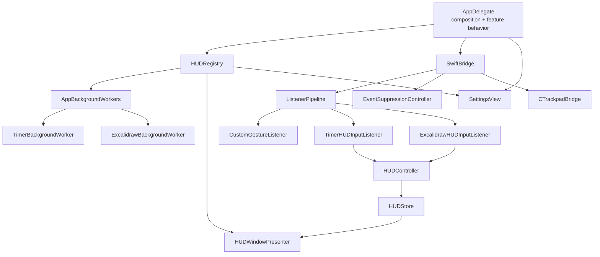

# Architecture Review

Date: 2026-07-16  
Scope: Static review of drift's Swift/macOS architecture  
Focus: Ownership, lifecycle, and extensibility

## Executive summary

The codebase has several strong architectural foundations:

- `ListenerPipeline` is a deep module with a compact interface that localizes listener ordering, claims, cancellation, suppression aggregation, and diagnostics.
- `HUDController` clearly owns the single-active-HUD invariant and adapts synchronous listener calls to main-actor rendering.
- Foreground-event suppression has an explicit fail-open lifecycle aligned with ADR-0001.
- Custom gesture persistence and Excalidraw document storage have clear ownership and good locality.

The main architectural friction is not a lack of modules. It is that several ownership and lifecycle seams do not align with the concepts they claim to own:

1. App-wide Timer and Excalidraw runtimes are owned and exposed through `HUDRegistry`.
2. Timer/Pomodoro runtime resources have startup hooks but no symmetric teardown.
3. `EventSuppressionController` claims cross-thread ownership through `@unchecked Sendable`, while some lifecycle state is mutated outside the locks that protect related reads.
4. `BackendEvent` mixes observations with commands, so effect ownership varies by event case.
5. `AppDelegate` is both the composition root and the implementation owner for several features.
6. `CTrackpadBridge` presents an instance interface over a hidden process-global callback target.

The top recommendation is to clarify app-wide runtime ownership first. That seam currently drives lifecycle ambiguity and makes feature addition cross too many modules. The concurrency concern in `EventSuppressionController` should receive the highest correctness priority because it sits on the safety-critical foreground-event suppression path.

## Review method

This was a read-only static architecture review. No application code was changed and no build or test command was run.

The review used the following criteria:

- **Ownership:** Is there one clear module responsible for each piece of mutable state, resource, and policy?
- **Lifecycle:** Does the owning module acquire, operate, and release its resources through a coherent interface?
- **Extensibility:** Can a new feature or behavior be added with local changes, or does knowledge spread across unrelated callers?
- **Depth:** Does a module hide meaningful implementation behind a small interface?
- **Locality:** Are related decisions, bugs, and verification concentrated?
- **Leverage:** Does one interface serve multiple callers and tests without exposing internal coordination?
- **Deletion test:** If the module disappeared, would its complexity vanish, or merely spread into callers?

Recommendation strength:

- **Strong:** Clear architectural friction with concrete ownership, lifecycle, correctness, or extensibility consequences.
- **Worth exploring:** Real friction, but the best seam depends on future product direction.
- **Speculative:** A possible concern without enough current evidence to justify restructuring.

## Current architecture

The graph is coherent at a high level: input is normalized, listeners decide, the HUD module owns one active session, and app-owned runtimes outlive individual HUD views. The friction appears where the graph assigns ownership to `HUDRegistry` while callers treat the same objects as app-wide feature runtimes.

## Findings

### 1. App-wide runtime ownership is routed through the HUD registry

**Recommendation strength: Strong**

**Primary files**

- `Sources/drift/Features/HUD/HUDRegistry.swift`
- `Sources/drift/App/AppBackgroundWorkers.swift`
- `Sources/drift/Features/HUD/Timer/TimerHUDDefinition.swift`
- `Sources/drift/App/AppDelegate.swift`
- `Sources/drift/Features/Settings/SettingsView.swift`

**Evidence**

- `HUDRegistry` creates and owns `AppBackgroundWorkers` at `HUDRegistry.swift:13-20`.
- It proxies application launch and termination to those workers at `HUDRegistry.swift:23-30`.
- It exposes concrete `ExcalidrawBackgroundWorker` and `TimerBackgroundWorker` instances to non-HUD callers at `HUDRegistry.swift:33-45`.
- `AppDelegate` obtains Settings dependencies through `hudRegistry.timerWorker` and `hudRegistry.excalidrawWorker` at `AppDelegate.swift:325-350`.
- `TimerHUDDefinition` receives the entire `AppBackgroundWorkers` container, then extracts the Timer worker at `TimerHUDDefinition.swift:45-61` and `TimerHUDDefinition.swift:77-88`.
- `AppBackgroundWorkers` stores erased workers by key but exposes concrete typed accessors through checked downcasts at `AppBackgroundWorkers.swift:13-32` and `AppBackgroundWorkers.swift:49-61`.

**Ownership assessment**

The app-wide Timer and Excalidraw runtimes outlive HUD presentations and are used by Settings, listeners, notifications, menu-bar items, local storage, and the Excalidraw server. Their owner is nevertheless named and located as a HUD registry.

The actual ownership rule is therefore implicit:

> The HUD registry owns app-wide feature runtimes, and unrelated app modules may reach those runtimes through concrete accessors.

That rule weakens locality. Understanding Timer ownership requires following `AppDelegate` → `HUDRegistry` → `AppBackgroundWorkers` → `TimerBackgroundWorker`, even when the caller is Settings rather than a HUD definition.

**Lifecycle assessment**

Application lifecycle is also proxied through the HUD registry. This makes the registry responsible for two separate concepts:

- registering renderable HUD definitions;
- owning and starting app-wide feature runtimes.

Those lifecycles currently happen together, but they are not inherently the same. A future app-wide feature without a HUD, or a HUD without a background worker, would make the mismatch more visible.

**Extensibility assessment**

Adding a new production feature can require coordinated edits to:

- `AppBackgroundWorkerKey`;
- `AppBackgroundWorkers` construction and concrete accessors;
- `HUDRegistry` definition builders and accessors;
- `AppDelegate` listener registration, menu behavior, event handling, Settings construction, or keyboard routing;
- `SettingsPage` and `SettingsView`;
- feature-specific models and views.

This is low locality and low leverage for the feature-registration seam.

**Deletion test**

Deleting `AppBackgroundWorkers` would mostly move its dictionary, lifecycle loops, and type knowledge into `HUDRegistry`; little complexity would disappear. In its current form it is a shallow module.

Deleting `HUDRegistry` would spread definition construction and worker ownership back into `AppDelegate`, so the registry does earn its existence. Its interface is broad because it combines two ownership roles.

**Architectural implication**

The codebase needs one explicit owner for app-wide feature runtimes and a separate, narrower HUD-definition registration responsibility. This review does not prescribe their future interfaces.

---

### 2. Timer/Pomodoro lifecycle teardown is missing

**Recommendation strength: Strong**

**Primary files**

- `Sources/drift/Core/Models/HUDModels.swift`
- `Sources/drift/App/AppBackgroundWorkers.swift`
- `Sources/drift/Features/Timers/TimerBackgroundWorker.swift`
- `Sources/drift/Features/Timers/BackgroundTimerCoordinator.swift`
- `Sources/drift/Features/Timers/TimerMenuBarController.swift`
- `Sources/drift/Features/Timers/TimerAlertCenter.swift`
- `Sources/drift/Features/Excalidraw/ExcalidrawBackgroundWorker.swift`

**Evidence**

- `HUDBackgroundWorker` defines launch and termination hooks, but supplies a default no-op termination implementation at `HUDModels.swift:62-73`.
- `AppBackgroundWorkers` advertises starting and stopping every worker at `AppBackgroundWorkers.swift:35-46`.
- `TimerBackgroundWorker` starts runtime wiring, menu-bar observation, and notifications at `TimerBackgroundWorker.swift:21-25`, but does not implement termination.
- `BackgroundTimerCoordinator` can own a repeating `Timer` at `BackgroundTimerCoordinator.swift:17-18` and `BackgroundTimerCoordinator.swift:196-222`.
- `TimerMenuBarController` owns a Combine subscription and `NSStatusItem` instances at `TimerMenuBarController.swift:12-17`, starts observation at `TimerMenuBarController.swift:28-37`, and creates/removes status items only as runtime state changes at `TimerMenuBarController.swift:45-90`.
- `TimerAlertCenter` assigns itself as the process notification-center delegate and can own active sounds at `TimerAlertCenter.swift:23-45` and `TimerAlertCenter.swift:60-67`.
- In contrast, `ExcalidrawBackgroundWorker` explicitly stops and releases its server at `ExcalidrawBackgroundWorker.swift:24-35`.

**Ownership assessment**

`TimerBackgroundWorker` is the correct apparent owner: it creates the Timer coordinator, alert center, and menu-bar controller and wires their callbacks. However, its ownership ends at startup. It does not express responsibility for releasing the resources it created.

**Lifecycle assessment**

The lifecycle interface promises symmetry but permits a silent no-op. Process termination currently masks the consequences because macOS will reclaim timers, subscriptions, status items, delegates, and sounds.

The missing teardown still matters architecturally:

- the worker cannot be safely restarted in tests or a future runtime reload;
- active sounds and status items have no owner-driven release path;
- notification delegation has no explicit end;
- lifecycle verification cannot use the worker's interface as its test surface.

**Extensibility assessment**

Any future need to disable, reload, replace, or test the Timer runtime will require callers to know its internal resources. That would leak implementation through the lifecycle seam and reduce locality.

**Deletion test**

Deleting `TimerBackgroundWorker` would spread event wiring and coordination among `AppDelegate`, Settings, HUD views, the alert center, and menu-bar presentation. The module is valuable and potentially deep; its lifecycle interface is incomplete.

**Architectural implication**

The module that starts the Timer/Pomodoro runtime should also own complete teardown. The default no-op termination hook currently makes incomplete ownership easy to miss.

---

### 3. Foreground-event suppression has partially synchronized lifecycle ownership

**Recommendation strength: Strong**

**Primary files**

- `Sources/drift/Infrastructure/Input/EventSuppressionController.swift`
- `Sources/drift/Infrastructure/Input/SwiftBridge.swift`
- `Tests/driftTests/EventSuppressionControllerTests.swift`
- `docs/adr/0001-fail-open-after-event-tap-disablement.md`

**Evidence**

- `EventSuppressionController` is marked `@unchecked Sendable` at `EventSuppressionController.swift:188-190`.
- It owns separate locks for suppression state and lifecycle policy at `EventSuppressionController.swift:193-196`.
- `update(_:)` holds the suppression lock while reading `tapSession` at `EventSuppressionController.swift:283-295`.
- `start`, `stop`, tap refresh, tap termination, installation, and manual retry read or mutate `tapSession`, callbacks, flags, and startup state outside that same lock at `EventSuppressionController.swift:263-280`, `EventSuppressionController.swift:297-307`, and `EventSuppressionController.swift:309-406`.
- Runtime tap-disable handling can also detach and clear `tapSession` from a callback path at `EventSuppressionController.swift:621-659`.
- `SwiftBridge.receive(_:)` can call `suppressionController.update(_:)` from input callback sources at `SwiftBridge.swift:120-145`.
- Existing tests thoroughly exercise lifecycle policy and teardown behavior, but do not exercise competing callback sources concurrently.

**Ownership assessment**

The controller has strong conceptual ownership: it concentrates permissions, tap installation, suppression requests, paired key/button release tracking, fail-open policy, and manual retry. This is valuable depth.

The concern is that its interface claims safe cross-thread use without one evident synchronization rule for all related mutable state. A caller cannot tell which operations may overlap or which executor owns lifecycle mutation.

**Lifecycle assessment**

The fail-open behavior itself is strong and aligned with ADR-0001:

- runtime disablement latches suppression off;
- polling stops;
- suppression state clears;
- the current tap session is detached and invalidated;
- recovery requires manual retry or a new process.

The architectural risk is below that policy: related state is protected by different mechanisms, while `@unchecked Sendable` places the proof obligation entirely inside the implementation.

**Extensibility assessment**

Adding another callback source, another recovery state, or another piece of tap-session state increases the chance that a new field follows the wrong synchronization rule. This is poor locality for concurrency invariants.

**Deletion test**

Deleting this module would spread safety-critical suppression behavior across the input bridge, permission checks, CoreGraphics callbacks, and listeners. It is a deep module and should remain one. Its concurrency seam needs to be made unambiguous.

**Architectural implication**

The module should have one explicit ownership model for lifecycle mutation and suppression updates. This review does not choose between actor isolation, a single lock, or another serialization model.

---

### 4. `BackendEvent` mixes observations and commands

**Recommendation strength: Strong**

**Primary files**

- `Sources/drift/Core/Models/BackendEvent.swift`
- `Sources/drift/Core/Models/ListenerModels.swift`
- `Sources/drift/Infrastructure/Input/Listeners/TimerHUDInputListener.swift`
- `Sources/drift/Infrastructure/Input/Listeners/ExcalidrawHUDInputListener.swift`
- `Sources/drift/Infrastructure/Input/Listeners/CustomGestureListener.swift`
- `Sources/drift/App/AppDelegate.swift`

**Evidence**

- `ListenerDecision.emittedEvents` is documented as observational, after listener effects have been applied, at `ListenerModels.swift:182-208`.
- `BackendEvent` repeats that observational contract at `BackendEvent.swift:55-74`.
- Timer and Excalidraw listeners operate `HUDController` and send HUD messages before emitting events that describe the completed effect.
- `CustomGestureListener` emits the selected `CustomGestureAction` at `CustomGestureListener.swift:69-79` and `CustomGestureListener.swift:133-147`.
- `AppDelegate` then performs that action at `AppDelegate.swift:254-263`.

**Ownership assessment**

Effect ownership varies by event case:

- Timer and Excalidraw listeners own the effect; `AppDelegate` observes it.
- Custom gesture listeners choose the effect; `AppDelegate` executes it.

The event enum therefore has two interfaces hidden behind one type. A caller must know case-specific semantics to use it correctly.

**Lifecycle assessment**

The mixed meaning complicates asynchronous delivery. `SwiftBridge` schedules event delivery on the main actor after listener processing. For observational events, delayed delivery changes only logging or secondary presentation. For a custom gesture command, delayed delivery postpones the primary user-visible effect.

**Extensibility assessment**

Adding a new listener effect requires deciding, without structural guidance, whether execution belongs:

- inside the listener before event emission;
- in `AppDelegate`;
- in another performer reached by `AppDelegate`.

The choice can spread changes across the listener, event enum, AppDelegate switch, and a performer module. This reduces locality.

**Deletion test**

Deleting `BackendEvent` would spread diagnostics and app-level reaction logic into listeners, so the seam is useful. Its interface should have one semantic meaning.

**Architectural implication**

Commands and observations need distinct ownership, even if they continue to share transport internally. This review does not propose their exact future interfaces.

---

### 5. `AppDelegate` combines composition with feature implementation

**Recommendation strength: Worth exploring**

**Primary file**

- `Sources/drift/App/AppDelegate.swift`

**Evidence**

`AppDelegate`:

- constructs most app stores, gates, controllers, listeners, presenters, and bridges at `AppDelegate.swift:6-135`;
- owns launch and termination ordering at `AppDelegate.swift:137-167`;
- creates the main menu and owns feature-specific menu behavior at `AppDelegate.swift:169-252`;
- handles feature-specific backend events, haptics, and diagnostics at `AppDelegate.swift:254-308`;
- constructs Settings with a long list of concrete stores and closures at `AppDelegate.swift:325-363`;
- fully owns virtual-trackpad persistence, window creation, screen placement, event monitors, transparency, and close synchronization at `AppDelegate.swift:365-456`;
- contains the advanced-gesture overlay presenter implementation at `AppDelegate.swift:473-560`.

**Ownership assessment**

An application delegate is a reasonable composition root and lifecycle entry point. The issue is not its size alone. It owns detailed feature policy and AppKit resources that could have clear feature owners:

- virtual-trackpad window lifecycle;
- advanced-gesture overlay lifecycle;
- feature menu behavior;
- event-specific logging and haptics;
- Settings dependency assembly.

This makes the composition root aware of internal feature state transitions.

**Lifecycle assessment**

The virtual-trackpad lifecycle is correctly implemented but local to `AppDelegate`, including two event monitor tokens and window delegate callbacks. Its resource ownership is therefore mixed with unrelated application composition.

**Extensibility assessment**

Adding a new production feature commonly requires touching `AppDelegate` in multiple sections. That creates a central merge point and forces maintainers to understand more of the app graph than the feature itself.

**Deletion test**

Deleting `AppDelegate` would spread application wiring and lifecycle entry points everywhere. It earns its existence. The deepening opportunity is to keep composition here while moving feature implementation behind feature-owned modules.

**Architectural implication**

This is worth exploring after app-wide runtime ownership is clarified. Moving code solely to reduce file length would fail the deletion test; only cohesive ownership should move.

---

### 6. `CTrackpadBridge` has hidden process-global ownership

**Recommendation strength: Worth exploring**

**Primary files**

- `Sources/drift/Infrastructure/Input/CTrackpadBridge.swift`
- `Sources/drift/Infrastructure/Input/SwiftBridge.swift`

**Evidence**

- `CTrackpadBridge` stores a static weak `current` callback target at `CTrackpadBridge.swift:10-11`.
- Every initializer replaces that process-global target at `CTrackpadBridge.swift:13-16`.
- `start` and `stop` appear instance-scoped at `CTrackpadBridge.swift:18-42`.
- Callback dispatch always routes through the latest static target at `CTrackpadBridge.swift:44-90`.
- `stop()` clears the instance handler but does not clear `current`.
- `SwiftBridge` constructs the adapter internally at `SwiftBridge.swift:18-25`.

**Ownership assessment**

The C library appears to support one process-wide callback session, but the Swift interface presents ordinary instance ownership. A second instance silently becomes the callback owner, regardless of which instance called `start()`.

The hidden invariant is:

> Only one `CTrackpadBridge` may exist meaningfully in the process, and the most recently initialized instance owns callbacks.

That invariant is part of the interface even though it is not explicit.

**Lifecycle assessment**

Instance `stop()` affects the process-global C bridge, while the static callback target can remain pointed at the stopped instance. The weak reference prevents retention, but ownership is still implicit.

**Extensibility assessment**

The design makes isolated tests, replacement adapters, multiple sessions, or runtime restart harder. Because there is only one production adapter, introducing a broad abstraction now would be a hypothetical seam. The immediate architectural need is explicit ownership, not abstraction for its own sake.

**Deletion test**

Deleting the module would spread unsafe pointer conversion and C callback translation into `SwiftBridge`, reducing locality. The module has real depth and should remain.

**Architectural implication**

If the process-global constraint is permanent, the module should make that ownership explicit. A replaceable seam becomes justified when a second adapter is actually needed.

## Architectural strengths

### `ListenerPipeline` is a deep module

`ListenerPipeline` exposes a compact `process` interface while localizing:

- registration order;
- stop propagation;
- exclusive claims;
- cancellation of competing listeners;
- reset delivery to cancelled listeners;
- suppression aggregation;
- diagnostic activity.

The tests exercise the same seam used by production callers in `Tests/driftTests/ListenerArchitectureTests.swift`. This is strong leverage and follows the principle that the interface is the test surface.

### HUD session ownership is centralized

`HUDController` owns the single-active-session invariant and provides synchronous operations to listener callback threads. `HUDVisibilityState` is a purposeful adapter for cross-thread visibility reads, while `HUDStore` drives main-actor rendering.

There is duplicated representation, but the ownership rule is substantially clearer than it first appears: `HUDController` owns the session; the other states are adapters for different execution contexts.

### Foreground-event suppression policy is explicit

The pure lifecycle policy and teardown behavior match ADR-0001. Runtime permission revocation and CoreGraphics disablement fail open, stop automatic recovery, clear suppression state, and require manual retry or a new process.

This is a good example of keeping safety policy local even though the synchronization implementation deserves further review.

### macOS support policy is respected

The availability-gated safe-area behavior at `AppDelegate.swift:551-559` is consistent with ADR-0002's macOS 13 support commitment.

### Excalidraw storage has good depth

`ExcalidrawDocumentStore` is large, but it concentrates filesystem layout, metadata, thumbnails, recents, rename, trash, and persistence behavior behind domain-oriented operations. Deleting it would spread substantial complexity across views and the web editor.

Its size is evidence of implementation depth, not by itself an architectural problem.

### Custom gesture persistence has clear ownership

- `CustomGestureStore` owns the thread-safe persisted gesture library.
- `CustomGestureSettingsModel` adapts that library to main-actor observation.
- `CustomGestureListener` consumes snapshots without owning Settings presentation.
- `CustomGestureRecordingSession` owns recording and test-session state.

This provides good locality across persistence, runtime recognition, and Settings presentation.

## Priority order

1. **Clarify app-wide runtime ownership.** It is the broadest source of lifecycle and extensibility friction.
2. **Audit and sharpen `EventSuppressionController` synchronization.** This has the highest correctness and safety impact.
3. **Complete Timer/Pomodoro teardown ownership.** The current lifecycle interface promises more than the implementation provides.
4. **Separate command ownership from observational events.** This is the strongest event-flow extensibility concern.
5. **Reassess feature implementation inside `AppDelegate`.** Do this only after the intended runtime seam is clear.
6. **Make the C bridge's process-global constraint explicit.** Avoid introducing a hypothetical seam until a second adapter is needed.

## Top recommendation

Start with the app-wide runtime ownership seam around:

- `HUDRegistry`;
- `AppBackgroundWorkers`;
- `TimerBackgroundWorker`;
- `ExcalidrawBackgroundWorker`;
- Settings dependency access.

This is the highest-leverage architectural area because it determines:

- who owns feature runtime resources;
- who starts and stops them;
- how HUD definitions obtain feature capabilities;
- how Settings obtains feature state;
- how many modules must change when a feature is added.

The review should next explore the intended ownership model without designing concrete interfaces prematurely.

## Verification notes

- Static source and test review only.
- No build or test command was run.
- No application code was modified.
- The only created file is this review document.
