# Current App Lifecycle

This documents the current implementation before the proposed listener-owned HUD redesign.

The important architectural fact is that HUD lifecycle is currently split across multiple owners:

- `AppDelegate` wires the app together and applies `BackendEvent` values to HUD state.
- `TimerHUDInputListener` recognizes gestures and emits Timer-specific HUD events, but does not own the HUD.
- `HUDStore` is the main-actor source used by the presenter to show and hide HUD windows.
- `HUDVisibilityState` is a thread-safe mirror of `HUDStore.activeHUDs` for listener/event-tap code.
- `HUDTestingState` separately tracks whether a HUD was opened from temporary menu-bar testing controls.
- `HUDWindowPresenter` renders active HUD definitions as `NSPanel` windows and sends outside-click and keyboard interactions back into `SwiftBridge`.
- `TimerHUDView` receives frontend HUD messages through `HUDMessageBus` and performs Timer HUD haptics.

## Type Ownership

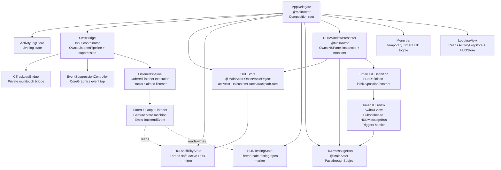

## App Startup

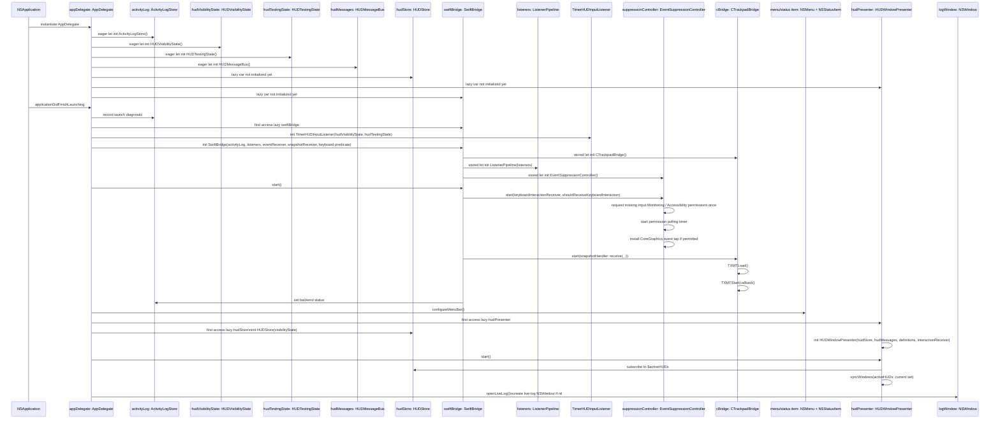

## Trackpad Snapshot Lifecycle

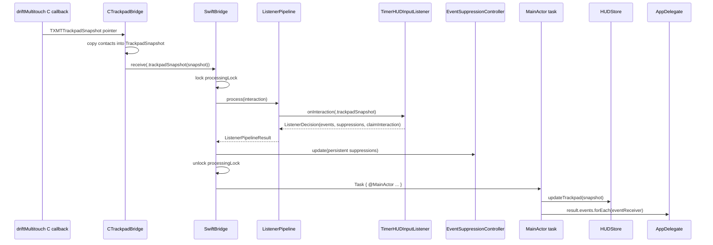

Key details:

- Listener processing is synchronous under `SwiftBridge.processingLock`.
- UI/log/event delivery happens later in a `Task { @MainActor in ... }`.
- This means listener state and suppression updates can advance before `AppDelegate.handleBackendEvent(_:)` mutates `HUDStore`.
- `HUDStore.updateTrackpad(_:)` updates layout/render state independently of HUD lifecycle.

## Listener Pipeline Claim Lifecycle

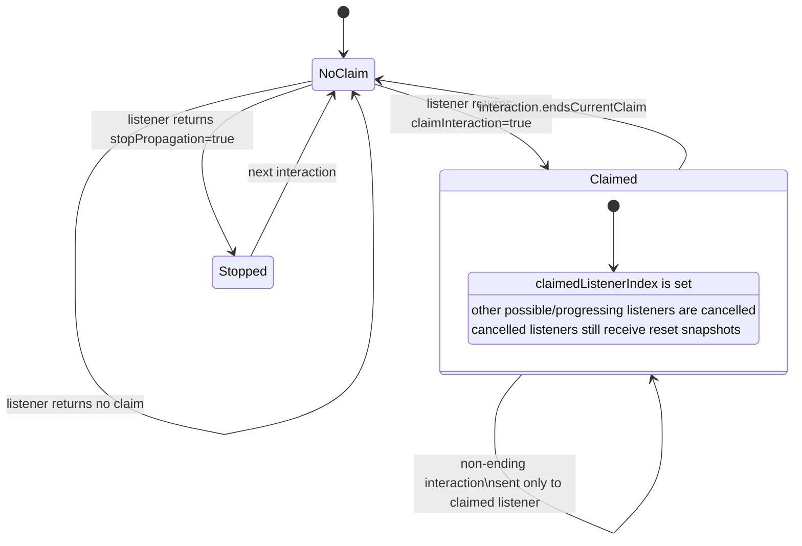

`Interaction.endsCurrentClaim` currently returns `true` for:

- `TrackpadSnapshot` with phase `.ended`
- `.clickOutside`
- Escape key via `.keyboardPress`

## Timer HUD Listener State Machine

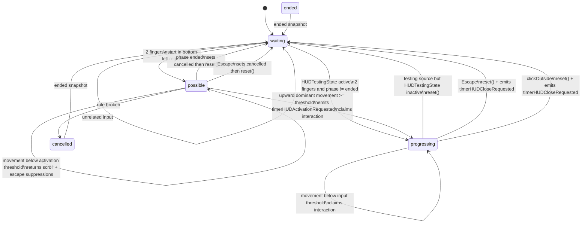

The listener has these internal fields:

- `gestureStatus`: `.waiting`, `.possible`, `.progressing`, `.cancelled`, `.ended`
- `pendingCenter`: previous normalized contact center used for deltas
- `pendingScale`: previous scale used for pinch deltas
- `activationSource`: `.activationGesture` or `.testingHUD`
- `hudVisibilityState`: mirror used to decide whether Escape should close a visible HUD
- `hudTestingState`: testing-only marker used to start input without the real bottom-left activation gesture

## Real Timer HUD Activation Lifecycle

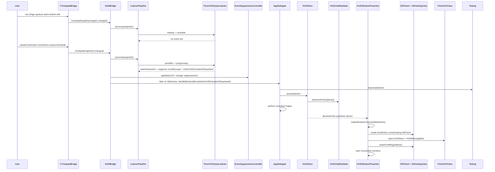

Important timing:

- The listener claims the gesture and suppression is updated synchronously.
- `HUDStore.activate(timer)` happens asynchronously later on the main actor.
- `HUDVisibilityState` only changes when `HUDStore.activate(_:)` runs.
- The window appears only after `HUDWindowPresenter` observes `HUDStore.$activeHUDs`.

## Timer HUD Input And Haptic Lifecycle

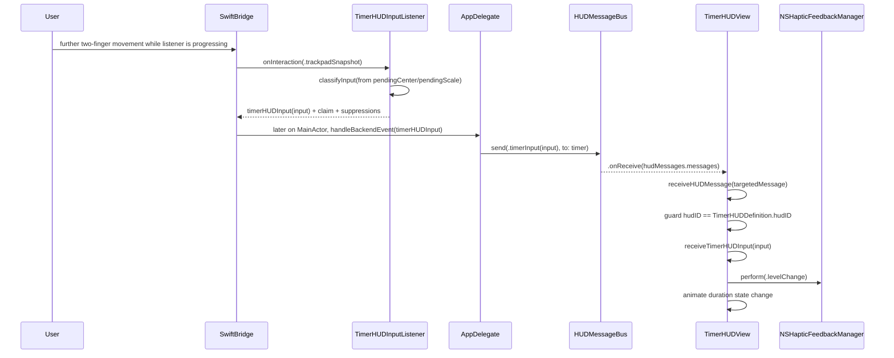

This means Timer HUD adjustment haptics are frontend-owned in the current implementation. The backend/listener emits `timerHUDInput`, but the haptic that repeats during scrolling lives inside `TimerHUDView.receiveTimerHUDInput(_:)`.

## Menu Testing HUD Lifecycle

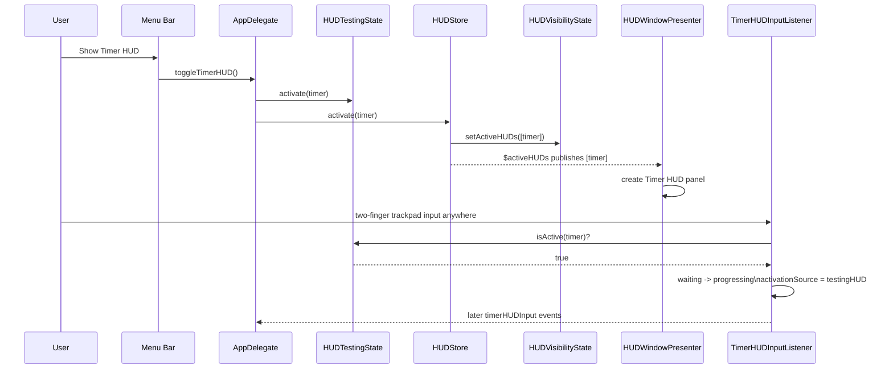

Menu close is similarly direct:

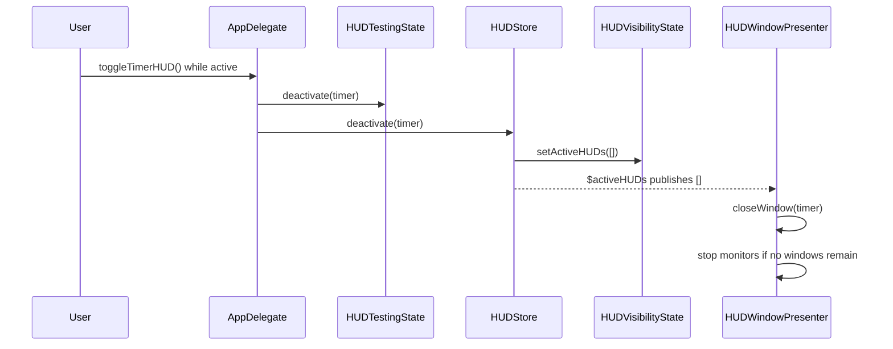

This path bypasses `BackendEvent` entirely. It is a test-only injection that directly mutates HUD lifecycle state from `AppDelegate`.

## Click Outside Close Lifecycle

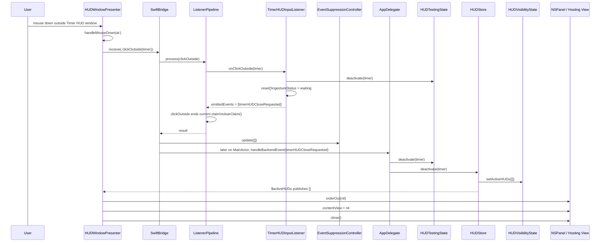

Current behavior to notice:

- `TimerHUDInputListener.onClickOutside(_:)` resets to `.waiting` before the HUD has been closed by `AppDelegate` and `HUDWindowPresenter`.
- `HUDTestingState` is deactivated both in the listener and again in `AppDelegate.handleBackendEvent(_:)`.
- `HUDVisibilityState` is not changed by the listener; it changes only when `HUDStore.deactivate(_:)` runs later.
- `clickOutside` ends the pipeline claim immediately.

## Escape Close Lifecycle

```mermaid
sequenceDiagram
    participant User
    participant EventTap as EventSuppressionController
    participant Presenter as HUDWindowPresenter
    participant Bridge as SwiftBridge
    participant Listener as TimerHUDInputListener
    participant Delegate as AppDelegate
    participant Store as HUDStore
    participant Presenter2 as HUDWindowPresenter

    User->>EventTap: Escape key down
    EventTap->>EventTap: if key should be forwarded, build KeyboardPressInteraction
    EventTap->>Bridge: receive(.keyboardPress(escape))
    Bridge->>Listener: onKeyboardPress(escape)
    Listener->>Listener: reset/cancel depending on gestureStatus
    Listener-->>Bridge: suppress Escape; maybe emit timerHUDCloseRequested
    Bridge-->>EventTap: suppressions
    EventTap->>EventTap: suppress keyDown and matching keyUp when requested
    Bridge->>Delegate: later handleBackendEvent(timerHUDCloseRequested)
    Delegate->>Store: deactivate(timer)
    Store-->>Presenter2: close Timer HUD window

    User->>Presenter: local/global key monitor may also see keyDown
    Presenter->>Bridge: receive(.keyboardPress(escape))
```

Escape can enter the listener through two routes:

- `EventSuppressionController` global event tap, gated by `shouldReceiveKeyboardInteraction`.
- `HUDWindowPresenter` local/global keyboard monitors while HUD windows are visible.

The listener suppresses Escape when it handles it. In local monitor code, Escape returns `nil` immediately for local key events.

## HUD Rendering Lifecycle

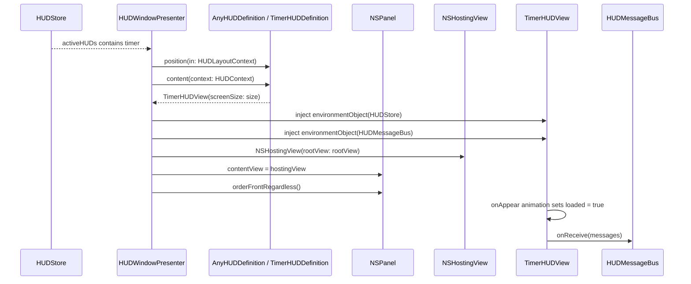

Closing is the inverse:

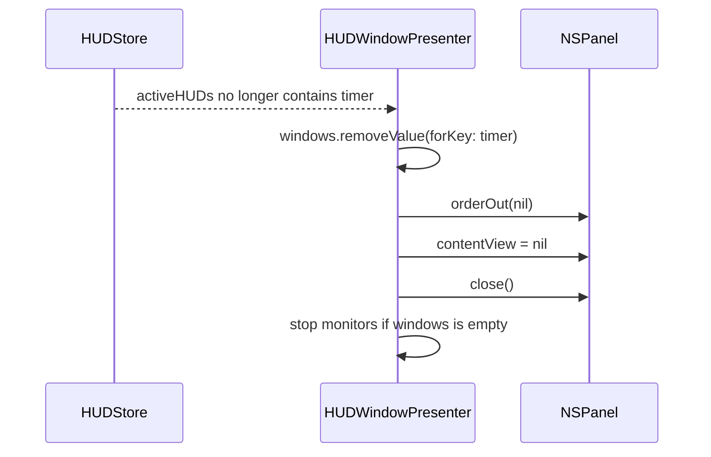

`contentView = nil` is important because `NSPanel.isReleasedWhenClosed` is `false`. Without detaching the hosting view, the SwiftUI view tree and its `.onReceive` subscription can survive the visible window close.

## Event Suppression Lifecycle

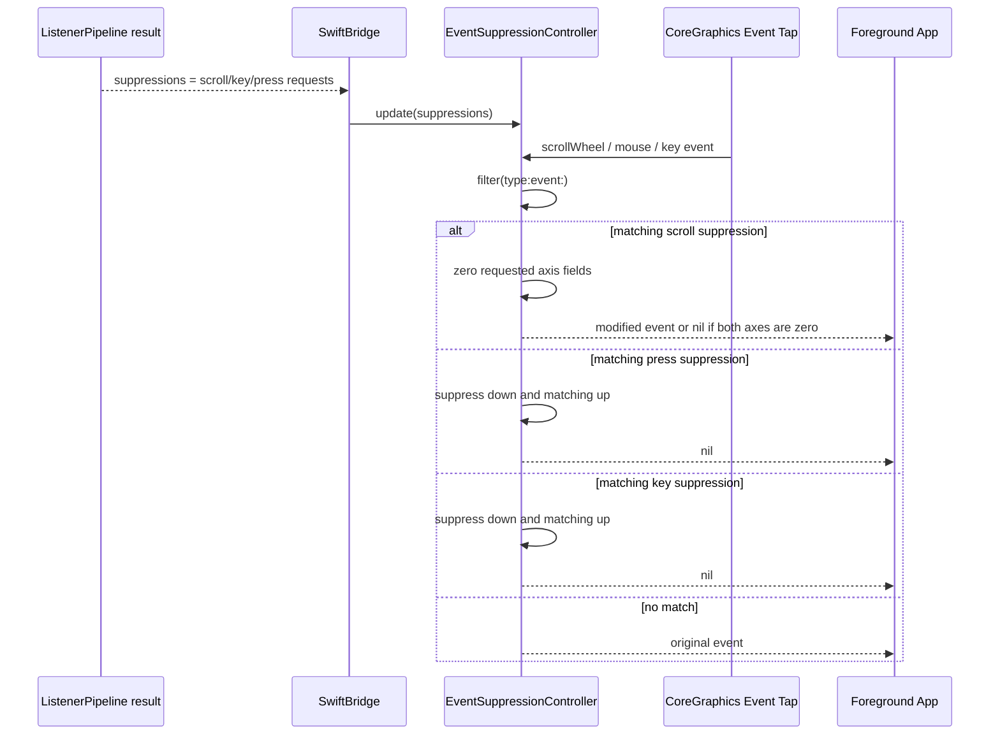

Suppression state is replaced after every processed interaction. For keyboard interactions, `SwiftBridge.persistentSuppressions(from:for:)` removes one-shot key suppressions after processing the key press while preserving non-key suppressions.

## App Shutdown

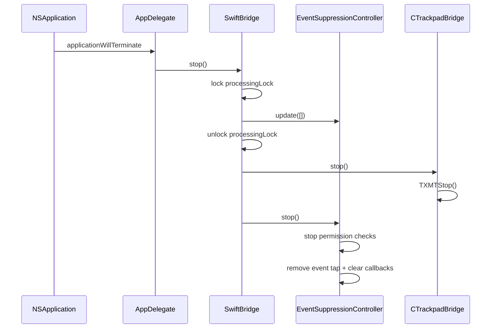

## Current Race-Prone Boundaries

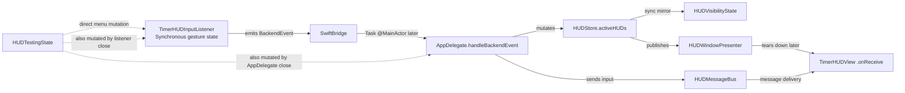

The main lifecycle tension is that listener state, suppression state, HUD visibility state, and SwiftUI view lifetime do not change in one synchronous ownership boundary.

Specific current split points:

- Listener close handlers emit `timerHUDCloseRequested`, but actual `HUDStore.deactivate(_:)` happens later in `AppDelegate`.
- Listener close handlers call `reset()` immediately, before presenter teardown has completed.
- `HUDVisibilityState` follows `HUDStore`, not listener intent.
- `HUDTestingState` is mutated by both the menu path and listener close path.
- Timer HUD input messages are delivered through `HUDMessageBus` to any still-subscribed `TimerHUDView`.
- Timer HUD scroll haptics happen only in `TimerHUDView.receiveTimerHUDInput(_:)`.

## File Map

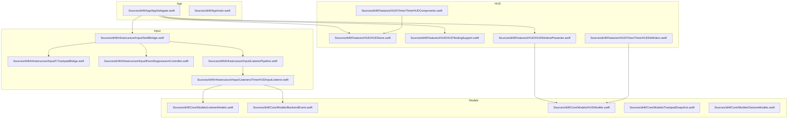
